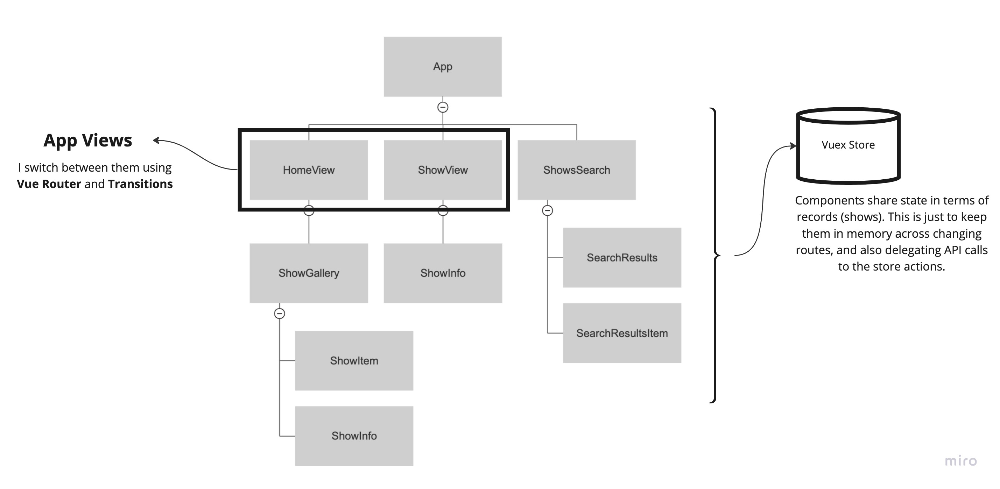

# sample-app

## Architecture

The application is following a default architecture provided by the Vuejs CLI.

Everything is custom UI except for the icons which are included from the Font Awesome library.

Here's an explanation of the why's of the stack involved:

- Vue.js (3.0): because it's the framework that the company use and is the one I'm more familiar with.
- TypeScript: To make sure data structures follow proper and predefined types, error prevention.
- Vue Router (4.0): to allow developers to easily manage the SPA of the application.
- Vuex (4.0): to centralize some state across different views and reduce unnecessary event bubbling complexity.
- SASS: to write more easy to understand styling code.

Plugins:
- Font Awesome (regular)

### Project Structure



## Project setup
```
npm install
```

### Compiles and hot-reloads for development
```
npm run serve
```

### Compiles and minifies for production
```
npm run build
```

### Run your unit tests
```
npm run test:unit
```

### Lints and fixes files
```
npm run lint
```

### Customize configuration
See [Configuration Reference](https://cli.vuejs.org/config/).
